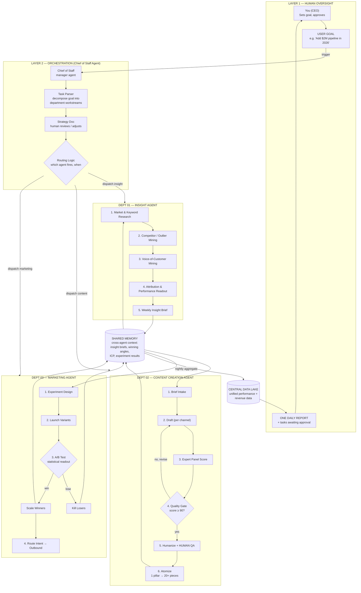

# Content & Marketing Agent Company — Build Blueprint

A practical blueprint for running an "AI agent company" for **insight, content creation, and marketing distribution** — adapted from the department-based agent architecture pattern (human oversight layer → orchestrator → department agents → shared memory → data lake) and mapped to the skills already in this repository so you can build it today.

**The core idea:** you don't hire a content team, you deploy one. A single orchestrator agent decomposes your business goal into department-level work, three department agents (Insight, Content, Marketing) execute in loops, everything they learn lands in a shared memory layer that makes every other agent smarter, and you — the human — only touch the system at defined approval gates and via one daily report.

---

## 1. The Architecture at a Glance



**The five load-bearing decisions in this design:**

1. **Humans set direction and approve; agents execute.** You appear in exactly three places: the goal, the approval gates, and the daily report. Everything else runs without you.
2. **One orchestrator, not agent spaghetti.** Department agents never talk to each other directly. The Chief of Staff routes work; shared memory carries context. This is what keeps a multi-agent system debuggable.
3. **Shared memory is the moat.** The Insight Agent's finding ("comparison posts outperform how-tos 3:1 for our ICP") must be readable by the Content Agent tomorrow without a human ferrying it across. No shared memory = three disconnected chatbots.
4. **Every agent loop ends in a measurable artifact** — a brief, a scored draft, an experiment readout — never in "I did some research."
5. **Kill/scale logic is explicit.** The marketing loop's A/B fork (kill losers, scale winners) is the engine of compounding. Without it you have a content mill, not a growth system.

---

## 2. Layer 1 — Human Oversight & Reporting

| Element | What it is | Cadence |
|---|---|---|
| **User Goal** | One quantified business outcome (e.g. "Add $2M in content-sourced pipeline"). Not a task list — the orchestrator decomposes it. | Set quarterly, revised as needed |
| **Daily Report** | Single digest: what every agent did, what moved, and the ≤5 items awaiting your approval. | Daily, one message/email |
| **Approval Queue** | The only inbox agents can put work in. Each item = context + AI recommendation + one-click approve/reject. | Reviewed daily |

### Human approval gates (the non-negotiables)

Agents draft; humans approve at exactly these points:

| Gate | Owner dept | Why it's gated |
|---|---|---|
| Strategy doc before a new goal kicks off | Orchestrator | Direction is human territory |
| Any content **publishing externally** (final QA) | Content | Brand risk, factual risk |
| Ad **budget increases** beyond a preset cap (e.g. >20%/day) | Marketing | Spend risk |
| Outbound sequences to **new segments** | Marketing | Deliverability + reputation risk |
| ICP redefinition | Insight | Changes everything downstream |

Everything else — research, drafting, scoring, killing losing ad sets, syncing data — is autonomous.

### Daily report template

```
📊 DAILY REPORT — {date}

GOAL: {goal} — {pace vs. target, e.g. "62% to Q3 pipeline target, on pace"}

INSIGHT AGENT
  • {top finding of the day, 1 line}
  • {n} keywords/opportunities added to backlog

CONTENT AGENT
  • {n} pieces drafted, {n} passed quality gate (avg score {x})
  • {n} awaiting your QA ⚠️

MARKETING AGENT
  • {n} experiments live | killed {n} losers (saved ${x}) | scaled {n} winners
  • Best variant: {name} — {metric} ({delta} vs control)

⚠️ AWAITING YOUR APPROVAL ({n})
  1. {item} — {AI recommendation}
  2. ...

TOMORROW: {orchestrator's planned dispatches}
```

---

## 3. Layer 2 — Orchestration (Chief of Staff Agent)

**Mission:** translate the human goal into department workstreams, decide which agent fires when, and aggregate results upward.

**The loop:**

1. **Parse the goal** → decompose into department objectives with numbers attached.
   *"Add $2M pipeline"* → Insight: "identify 3 highest-intent segments + 50-topic backlog"; Content: "ship 8 pillar pieces + 160 derivatives/month at 90+ quality"; Marketing: "run 6 experiments/month, kill/scale weekly, route intent to outbound."
2. **Write the strategy doc** → human reviews and adjusts once (this is a gate).
3. **Route** — dispatch on triggers, not just schedules:
   - **Scheduled:** Insight runs Mon (weekly brief); Content runs on brief delivery; Marketing readouts Fri.
   - **Event-driven:** competitor launches → dispatch Insight; content piece passes gate → dispatch Marketing to distribute; experiment hits significance → dispatch kill/scale.
4. **Aggregate** — collect department outputs nightly into the data lake, compose the daily report, populate the approval queue.

**Implementation note:** start with the orchestrator as a scheduled Claude Code session (or cron-triggered routine) holding the strategy doc + routing rules in its context, dispatching subagents per department. Don't build a routing framework first — encode routing rules as a simple table the orchestrator reads.

---

## 4. Department 01 — Insight Agent

**Mission:** turn market noise into a ranked, evidence-backed opportunity backlog that the other two agents consume. Insight is upstream of everything — a mediocre content agent with great insight beats the reverse.

**Pipeline:**

| Step | What it does | Repo skill to use |
|---|---|---|
| 1. Market & keyword research | Find keyword gaps and rising topics competitors missed | [`seo-ops`](../seo-ops/) — Content Attack Briefs, GSC Optimizer, Trend Scout |
| 2. Competitor / outlier mining | Detect outlier content and packaging patterns worth reverse-engineering | [`yt-competitive-analysis`](../yt-competitive-analysis/) — Outlier Detector, Title Pattern Extractor |
| 3. Voice-of-customer mining | Extract real objections, phrases, and pain language from sales calls | [`revenue-intelligence`](../revenue-intelligence/) — Gong Insight Pipeline; [`content-ops`](../content-ops/) — Quote Miner |
| 4. Attribution readout | Prove which content actually sourced revenue; feed win/loss data back into targeting | [`revenue-intelligence`](../revenue-intelligence/) — Revenue Attribution; [`sales-pipeline`](../sales-pipeline/) — ICP Learner |
| 5. Weekly Insight Brief | Synthesize 1–4 into one ranked brief written to shared memory | (orchestrated synthesis step) |

**Output contract — the Weekly Insight Brief** (this exact shape lands in shared memory):

```yaml
week: 2026-W31
icp_updates: []            # changes to ideal customer profile, with evidence
top_opportunities:         # ranked, max 10
  - topic: ""
    format_recommendation: ""   # from outlier analysis
    evidence: ""                # search volume / competitor gap / VoC quotes
    intent_level: high|mid|low
    est_difficulty: 1-5
voc_language:              # verbatim customer phrases for the Content Agent
  - quote: ""
    source: ""
performance_learnings:     # what worked/failed last week, from attribution
  - finding: ""
    action: ""             # what Content/Marketing should change
```

**KPIs:** % of published content originating from brief opportunities · brief-to-winner rate (opportunities that became scaled winners) · ICP prediction accuracy vs. actual closed-won.

---

## 5. Department 02 — Content Creation Agent

**Mission:** turn insight briefs into published-quality content at volume, with a hard quality floor. The defining feature is the **quality gate loop** — content recursively revises until it scores 90+, and only then reaches a human.

**Pipeline:**

| Step | What it does | Repo skill to use |
|---|---|---|
| 1. Brief intake | Pull top opportunity + VoC language from shared memory; select format per channel | (reads Insight Brief) |
| 2. Draft | Generate the pillar piece in the recommended format | [`content-ops`](../content-ops/) — Editorial Brain; [`x-longform-post`](../x-longform-post/) for X articles |
| 3. Expert panel score | Score the draft with domain-specific expert personas | [`content-ops`](../content-ops/) — Expert Panel (9 experts, 5 rubrics) |
| 4. Quality gate | Score < 90 → revise with panel feedback and re-score (loop). Score ≥ 90 → proceed | [`content-ops`](../content-ops/) — Quality Gate |
| 5. Humanize + human QA | Strip AI patterns; human does final read (**approval gate**) | [`x-longform-post`](../x-longform-post/) — 24-pattern slop detector / Humanizer |
| 6. Atomize | Explode 1 pillar into 20+ channel-native derivatives + visual assets | [`podcast-ops`](../podcast-ops/) — Podcast-to-Everything Pipeline; [`deck-generator`](../deck-generator/) for visuals |
| (optional) Variant engine | For conversion-critical pieces (landing pages, lead magnets): generate 50+ variants, score, evolve winners | [`autoresearch`](../autoresearch/) — Variant Generator, Evolution Engine |

**Rules that keep it honest:**

- **No draft skips the panel.** The gate is the product; volume without the gate is spam.
- **VoC language is mandatory input** — every piece must use at least 2 verbatim customer phrases from the brief. This is what makes agent content sound human.
- **Atomization is a step, not an afterthought.** The unit of production is "1 pillar + its derivative set," never a lone post.
- Log every piece's final score, revision count, and brief-of-origin to shared memory — the Insight Agent's attribution step needs it.

**KPIs:** avg. panel score at publish · revision cycles per piece (should fall over time as shared memory improves prompts) · pieces/week per human QA hour · % of pieces traceable to an insight brief (target: 100%).

---

## 6. Department 03 — Marketing Agent

**Mission:** distribute content as experiments, not posts. Kill losers fast, scale winners hard, and route the demand it generates into pipeline.

**Pipeline:**

| Step | What it does | Repo skill to use |
|---|---|---|
| 1. Experiment design | Frame each distribution push as a hypothesis with a metric | [`growth-engine`](../growth-engine/) — Experiment Engine |
| 2. Launch variants | Publish/schedule content variants per channel; launch ad variants | [`growth-engine`](../growth-engine/) + channel APIs |
| 3. A/B readout | Statistical test (bootstrap CIs, Mann-Whitney U — not vibes) | [`growth-engine`](../growth-engine/) — Experiment Engine, Pacing Alerts |
| 3a. Kill losers | Auto-pause underperformers; log the loss + why to shared memory | [`growth-engine`](../growth-engine/) — Pacing Alerts |
| 3b. Scale winners | Increase budget/frequency on winners (**gate if beyond spend cap**) | [`growth-engine`](../growth-engine/) |
| 4. Route intent → outbound | High-intent engagers and site visitors get routed to sequences | [`sales-pipeline`](../sales-pipeline/) — RB2B Router, Trigger Prospector; [`outbound-engine`](../outbound-engine/) — Cold Outbound Optimizer |
| 5. Conversion feedback | Audit the landing pages traffic hits; feed CRO findings back | [`conversion-ops`](../conversion-ops/) — CRO Audit |
| 6. Weekly scorecard | Roll up all experiments into one readout for the data lake | [`growth-engine`](../growth-engine/) — Weekly Scorecard |

**Rules that keep it honest:**

- **Every launch is an experiment.** If it has no hypothesis and no metric, the orchestrator shouldn't dispatch it.
- **Kill thresholds are pre-committed** (e.g. "pause any ad set > $150 spend with CTR < 1σ below cohort mean"). Agents apply them without asking; humans only see the log.
- **Scaling is asymmetric-gated:** killing is autonomous (it saves money), scaling beyond the daily cap requires approval (it spends money).
- Winner/loser patterns (hooks, formats, angles) are written to shared memory — this is the Content Agent's most valuable input.

**KPIs:** experiment velocity (tests/month) · $ saved by kills · winner scale rate · content-sourced pipeline $ (the number that rolls up to the goal).

---

## 7. Shared Memory & Data Lake

Two distinct stores, doing different jobs:

**Shared Memory (hot, cross-agent context):** what agents read *before acting* and write *after acting*. Start embarrassingly simple — a `/memory` directory of structured markdown/YAML in this repo, committed on every write. Graduate to Redis + a vector DB only when retrieval (not storage) becomes the bottleneck.

```
memory/
├── icp.yaml                  # current ICP — ICP Learner owns writes
├── insight-briefs/           # weekly briefs (contract in §4)
├── winning-patterns.md       # hooks/formats/angles that scaled — Marketing owns
├── losing-patterns.md        # what died and why — equally valuable
├── voc-quotes.yaml           # customer language bank — Quote Miner owns
├── brand-voice.md            # style constraints — human owns
└── experiment-log.jsonl      # every experiment: hypothesis, result, decision
```

**Rules:** every file has exactly one owning agent for writes; every agent's prompt starts by reading the files relevant to its step; humans can edit anything (a human edit is ground truth).

**Central Data Lake (cold, nightly aggregate):** Postgres (or even SQLite to start) holding normalized performance rows — content pieces, experiments, spend, pipeline touches — aggregated nightly by the orchestrator. This is what the daily report and attribution queries run against. Schema can be three tables: `content(id, brief_id, channel, score, published_at)`, `experiments(id, content_id, hypothesis, metric, result, decision)`, `pipeline_events(id, source_content_id, stage, amount)`.

---

## 8. Build Roadmap — Ship One Agent First

The video's honest kicker applies: you won't deploy the mega-system on day one — **you'll deploy one agent.** Each phase must pay for itself before the next begins.

**Phase 1 (Weeks 1–2): Content Agent, human-orchestrated.**
You are the Chief of Staff. Run the content pipeline (§5) manually via the `content-ops` skills: brief → draft → expert panel → quality gate → humanize → publish. Create `memory/` and start logging scores and outcomes from day one — memory is cheap to write and expensive to backfill.
*Exit criteria: 10 pieces published at 90+, revision loop working, memory files populated.*

**Phase 2 (Weeks 3–4): Insight Agent feeds it.**
Stand up the weekly Insight Brief (§4) using `seo-ops` + `yt-competitive-analysis` + Quote Miner. The Content Agent now only works from briefs.
*Exit criteria: 2 consecutive weekly briefs; 100% of new content traceable to a brief.*

**Phase 3 (Weeks 5–6): Marketing Agent closes the loop.**
Wrap distribution in `growth-engine` experiments with pre-committed kill thresholds. Winner/loser patterns start flowing back into memory, and you should see Content Agent output improve without prompt changes — that's the flywheel catching.
*Exit criteria: 4 experiments completed with statistical readouts; ≥1 winner scaled; kill log non-empty.*

**Phase 4 (Weeks 7–8): Orchestrator + daily report.**
Only now automate yourself out: scheduled orchestrator session with the routing table (§3), nightly aggregation into the data lake, daily report + approval queue. Add `sales-pipeline` routing to connect marketing wins to revenue.
*Exit criteria: system runs 5 consecutive weekdays where your only inputs are approvals and the daily report takes <10 min to act on.*

**Later (tease, like the video's Finance/Hiring/Legal depts):** a Finance Agent on [`finance-ops`](../finance-ops/) (CFO briefing on content ROI) and a Sales Agent on [`sales-playbook`](../sales-playbook/) + [`outbound-engine`](../outbound-engine/) — same pattern: pipeline steps, human gates, shared memory, one report line.

---

## 9. Anti-Patterns (What Kills Systems Like This)

1. **Building the orchestrator first.** Orchestration with nothing to orchestrate is procrastination with extra YAML. Ship the Content Agent.
2. **Agents chatting with each other.** All cross-agent context goes through shared memory. Direct agent-to-agent calls create untraceable failure chains.
3. **No kill thresholds.** If losers need a human decision to die, they don't die, and the experiment budget bleeds out.
4. **Quality gate theater.** If the panel score can be overridden "just this once" to hit a deadline, the gate is decorative and the content converges to slop.
5. **Memory nobody reads.** Writing to memory without a read step in every agent's prompt is a diary, not a memory. Enforce read-before-act.
6. **Approval queue overflow.** If the human gate regularly holds >5 items, your gates are wrong — either widen agent autonomy (raise the spend cap) or lower volume. A jammed gate is worse than no gate: humans start rubber-stamping.

---

*Source pattern: "AI Agent Company — Mega System Architecture" (Structure Webworks, TikTok @structurewebworks), adapted for insight/content/marketing and mapped to the skills in this repository.*
