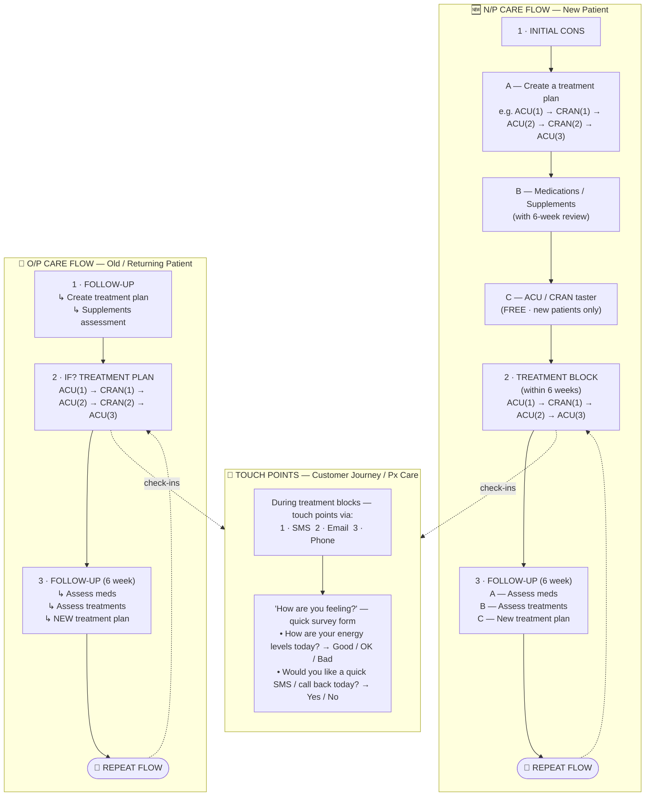

# Insight Clinic — Patient Care Flows (Px Care)

Digitised from the clinic flip‑chart. Two parallel journeys plus a shared touch‑point
layer that runs across every treatment block.

- **N/P Care Flow** — New Patient journey (left)
- **O/P Care Flow** — Old / returning Patient journey (right)
- **Touch Points** — SMS / Email / Phone check‑ins during treatment blocks

**Treatment key:** `ACU` = Acupuncture · `CRAN` = Cranial / Craniosacral therapy ·
`(1)(2)(3)` = session number in sequence · `Cons` = Consultation · `Meds` = Medications / Supplements

---

## Visual flow (side‑by‑side)

---

## N/P Care Flow — New Patient (step‑by‑step)

### 1. Initial Consultation
- **A — Create a treatment plan.** Map out the recommended sequence of sessions, e.g.
  `ACU(1) → CRAN(1) → ACU(2) → CRAN(2) → ACU(3)`.
- **B — Medications / Supplements.** Recommend supplements and set a **6‑week review**.
- **C — ACU / CRAN taster (FREE).** New‑patient‑only acquisition offer to get them into care.

### 2. Treatment Block *(within 6 weeks)*
- Deliver the planned sessions: `ACU(1) → CRAN(1) → ACU(2) → ACU(3)`.
- Run **Touch Points** (SMS / Email / Phone) throughout the block — see below.

### 3. Follow‑up *(6 week)*
- **A — Assess meds / supplements.**
- **B — Assess treatments** (progress against the plan).
- **C — Create a new treatment plan.**
- ➡️ **Repeat flow** — loop back into a new treatment block.

---

## O/P Care Flow — Old / Returning Patient (step‑by‑step)

### 1. Follow‑up
- Create a treatment plan.
- Run a supplements assessment.

### 2. *If?* Treatment Plan
- If a plan is warranted, deliver the sequence:
  `ACU(1) → CRAN(1) → ACU(2) → CRAN(2) → ACU(3)`.
- Run **Touch Points** (SMS / Email / Phone) throughout the block.

### 3. Follow‑up *(6 week)*
- Assess meds / supplements.
- Assess treatments.
- Create a **NEW** treatment plan.
- ➡️ **Repeat flow** — loop back into a new treatment block.

> **Note:** The free ACU / CRAN taster is a **new‑patient acquisition offer only** and does
> not appear in the O/P flow.

---

## Touch Points — Customer Journey / Px Care

Runs **during every treatment block**, in both flows.

**Channels:** 1. SMS  ·  2. Email  ·  3. Phone

**"How are you feeling?" — quick survey form**

| Prompt | Options |
|---|---|
| How are your energy levels today? | ☐ Good  ☐ OK  ☐ Bad |
| Would you like a quick SMS / call back today? | ☐ Yes  ☐ No |

A "Bad" energy answer or a "Yes" call‑back request should trigger a same‑day follow‑up
from the clinic.
